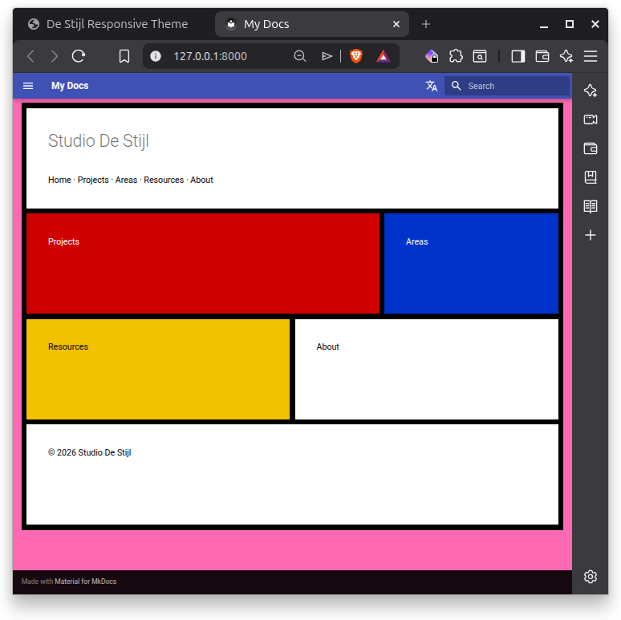

# Stijl Standard for MkDocs

**Stijl Standard** is a De Stijl (Mondrian-inspired) layout system designed for use with **Material for MkDocs**. It provides a clean, geometric grid structure for building visual navigation pages, landing layouts, and modular content panels while preserving compatibility with MkDocs' documentation workflow.

The system uses modern **CSS Grid** techniques combined with lightweight layout utilities to create compositions that resemble classic De Stijl paintings while remaining responsive and content-friendly.



Note: The hotpink background color is used to illustrate how the design, as content, vs. a landing page, is floating, like content with margin/padding at the top, left, right and bottom of the content area.

## Design Goals

The project was developed with several goals in mind:

- integrate cleanly with **Material for MkDocs**
- preserve the **content-first philosophy** of documentation systems
- provide a reusable **layout canvas**
- allow flexible **block compositions**
- maintain the visual clarity of **De Stijl geometry**
- remain **simple and maintainable**

The result is a layout layer that behaves as normal content inside MkDocs pages but can also support more visually expressive page compositions.

## Key Features

The system provides a small set of layout primitives:

### Grid Canvas

The layout canvas defines the Mondrian grid structure.

```css
.uc-stijl-grid {
  display: grid;
  grid-template-columns: repeat(6, 1fr);
  gap: var(--uc-line, 10px);
  padding: var(--uc-line, 10px);
  background: var(--uc-color-black, #000);
}
```

This element replaces the traditional wrapper used in standalone examples.

### Block Components

Blocks represent the colored panels in the composition.

```css
.uc-block {
  display: flex;
  flex-direction: column;
  justify-content: space-between;
  padding: var(--uc-space-xl);
}
```

Blocks may contain headings, text, links, or navigation elements.

### Color Variants

Several color modifiers are provided:

```
.uc-block--red
.uc-block--blue
.uc-block--yellow
.uc-block--white
```

These correspond to the classic De Stijl palette.

### Grid Span Utilities

Blocks are positioned using span utilities.

```
.uc-span-1
.uc-span-2
.uc-span-3
.uc-span-4
.uc-span-5
.uc-span-6
```

Example:

```html
<section class="uc-block uc-block--red uc-span-4">
Projects
</section>
```

## Example Layout

Example composition:

```
Projects  Projects  Projects  Projects  Areas  Areas
Resources Resources Resources About     About  About
```

Example markup:

```html
<div class="uc-stijl-grid">

<section class="uc-block uc-block--red uc-span-4">
<h2>Projects</h2>
</section>

<section class="uc-block uc-block--blue uc-span-2">
<h2>Areas</h2>
</section>

<section class="uc-block uc-block--yellow uc-span-3">
<h2>Resources</h2>
</section>

<section class="uc-block uc-block--white uc-span-3">
<h2>About</h2>
</section>

</div>
```

This structure can be placed directly inside a Markdown page.

## Integration with Material for MkDocs

Stijl Standard is designed to function as **page content**, not as a full site template. This ensures compatibility with Material's navigation, search, and documentation layout.

Typical page structure:

```
Material Header
Page Content
Stijl Grid Layout
Material Footer
```

This allows the system to be used for:

- homepage layouts
- visual navigation panels
- section landing pages
- project dashboards

without interfering with the underlying documentation framework.

## Layout Modes

Two layout approaches are possible:

### Content Mode

The grid behaves as standard page content.

```
header
content (grid)
footer
```

### Viewport Mode

The grid fills the available vertical space between header and footer.

```
header
viewport grid
footer
```

Viewport mode can be enabled using a wrapper modifier if desired.

## Responsive Behaviour

The layout can support traditional responsive breakpoints or more fluid grid strategies using modern CSS Grid features such as:

- `auto-fit`
- `minmax()`
- proportional row sizing

These techniques allow the grid to recompute itself across screen sizes while preserving the Mondrian composition.

## Project Structure

A typical structure for the project might look like this:

```
stijl-standard-mkdocs/
│
├─ docs/
│  └─ examples/
│
├─ assets/
│  └─ css/
│     └─ stijl-standard.css
│
├─ README.md
└─ LICENSE
```

The CSS file provides the layout system while documentation and examples demonstrate how to use it within MkDocs pages.

## Inspiration

The layout system draws inspiration from **De Stijl**, an early twentieth-century art movement associated with artists such as Piet Mondrian and Theo van Doesburg.

The movement emphasized:

- geometric abstraction
- primary colors
- strong horizontal and vertical lines
- balanced asymmetry

These principles translate naturally into modern CSS Grid layouts.

## License

This project documentation, *Stijl Standard for MkDocs*, by **Christopher Steel**, with AI assistance from **ChatGPT-4 (OpenAI)**, is licensed under the [Creative Commons Attribution-ShareAlike 4.0 License](https://creativecommons.org/licenses/by-sa/4.0/).

