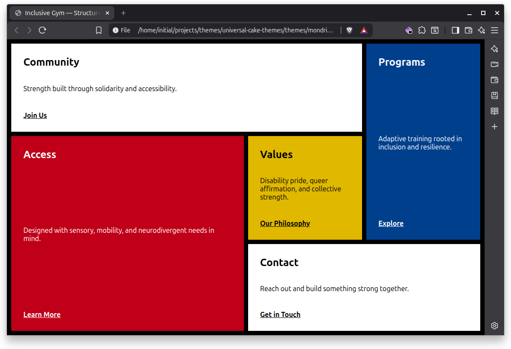
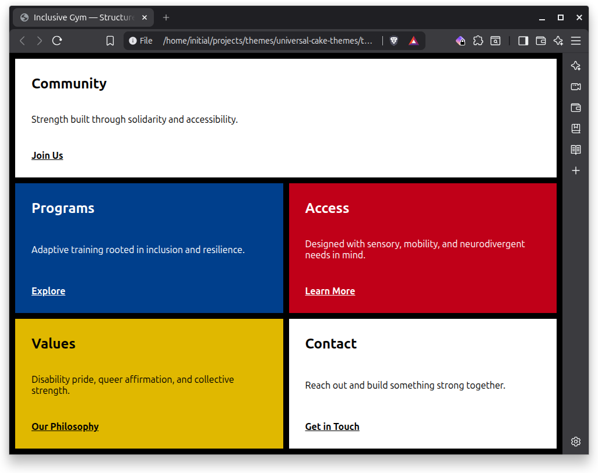
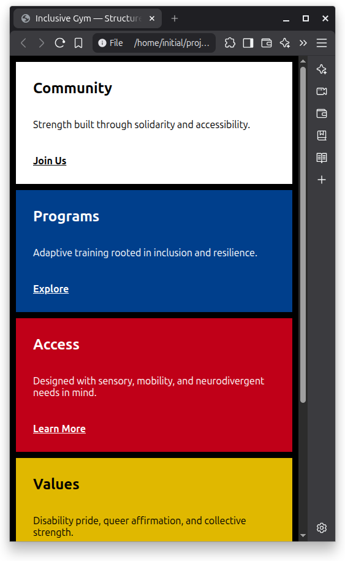

# Mondrian Grid

An experimental grid-based theme inspired by the work of Piet Mondrian and the De Stijl movement.

This theme explores structural clarity through asymmetrical block composition, primary color segmentation, and strong visual boundaries. It adapts geometric abstraction into an accessible, responsive web layout using only HTML and CSS.

---

## Responsive Views

### Desktop

### Tablet

### Mobile

## Design Intent

The Mondrian Grid theme strives for:

- Structural clarity through segmentation  
- Equal visual footing between content regions  
- Interdependence expressed through geometric order  
- Bold visual identity without JavaScript  
- Design restraint through limited palette and motion  

The grid is not decorative. It organizes meaning.

---

## Layout Characteristics

- CSS Grid as the primary layout system  
- Asymmetrical block composition  
- Linear DOM reading order  
- Thick grid gaps functioning as structural lines  

### Responsive Behavior

- 4-column layout on desktop  
- 2-column layout on tablet  
- 1-column stacked layout on mobile  

The layout collapses predictably without disrupting reading order.

---

## Accessibility

This theme was designed with accessibility in mind:

- Semantic HTML structure  
- Logical heading hierarchy  
- Visible `:focus-visible` outlines  
- Underlined links (not color-only differentiation)  
- WCAG AA contrast targets  
- No motion effects  
- No JavaScript required for core functionality  

Accessibility is treated as baseline, not enhancement.

---

## Agnosticism

- Pure HTML and CSS  
- No external dependencies  
- No CDN resources required  
- Responsive via media queries  
- Designed to render consistently across modern browsers  
- resilience over spectacle.

---

## Intended Use

- My personal website
- Landing pages  
- Sectioned content hubs  
- Structural demonstrations  
- Visual experiments in grid-based layout  

It is currently considered experimental.

---

## Resources

Found some interesting Mondrian toys!

* [makemeamondrian.com](https://makemeamondrian.com/)
* [Figma Community Plugin](https://www.figma.com/community/plugin/1246140262448004218/mondrian-grid)
* [getmondrian.com](https://getmondrian.com)
  * [On Github](https://github.com/TimMikeladze/getmondrian)

## License

Unless otherwise noted, this theme is licensed under CC BY-SA 4.0.