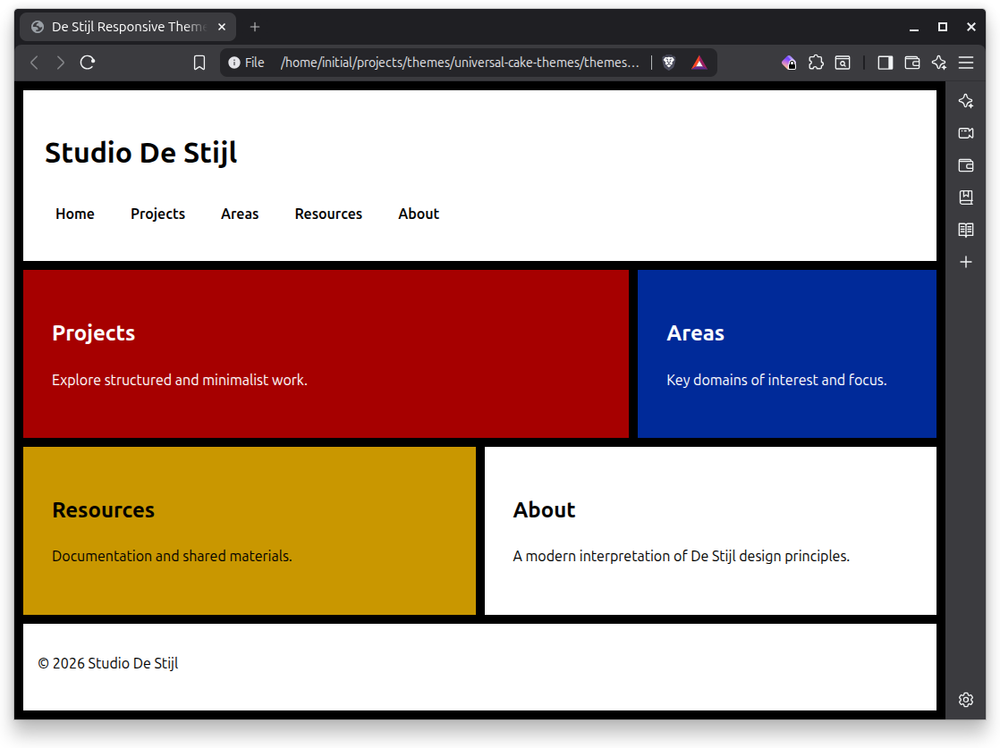
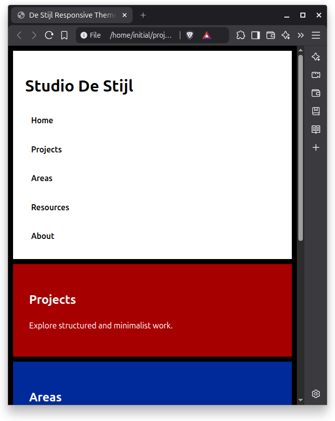
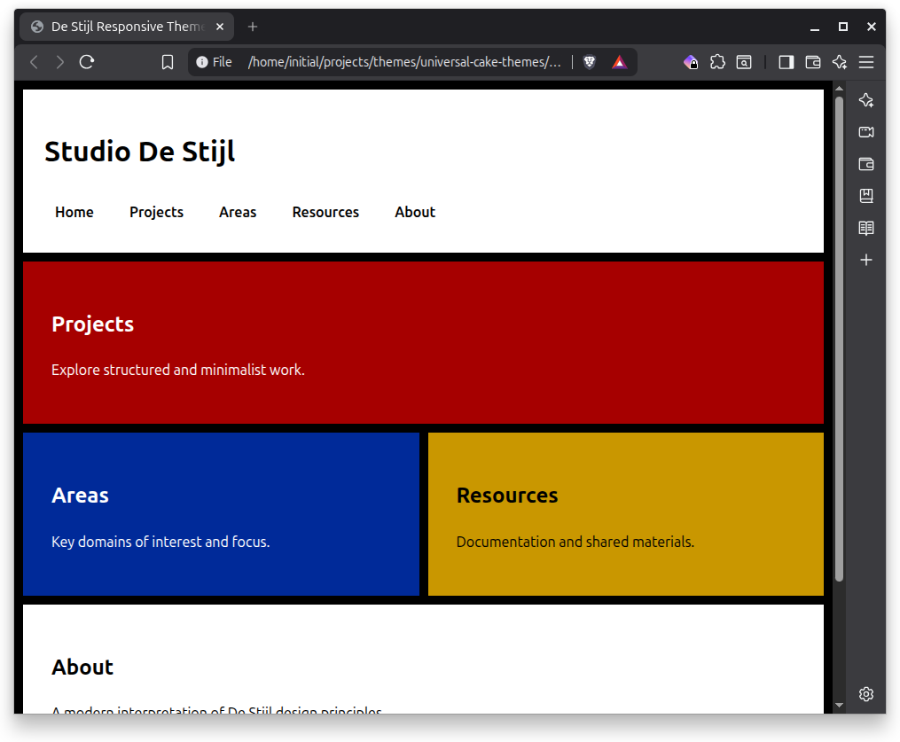

# Stijl-AA

A responsive, WCAG AA–compliant theme inspired by the Dutch **De Stijl** movement and artists like **Piet Mondrian** and **Theo van Doesburg**.

Stijl-AA is a modern, accessibility-first interpretation of geometric minimalism — designed for clarity, structure, and strong color contrast while remaining lightweight and framework-agnostic.

------

## Images

### Desktop



### Tablet



### Mobile



## Design Philosophy

Stijl-AA follows core **De Stijl** principles:

- Grid-based layout
- Strong primary colors
- High contrast
- Asymmetrical balance
- Functional minimalism

This version specifically targets **WCAG 2.x AA contrast compliance**.

------

## Features

- Responsive CSS Grid layout
- WCAG AA color contrast
- Skip link for keyboard users
- Accessible focus styles (high visibility outline)
- Reduced motion support
- Mobile-first responsive breakpoints
- No JavaScript required
- No dependencies
- System font stack

------

## Color System (AA Tuned)

| Variable   | Value     | Usage                  |
| ---------- | --------- | ---------------------- |
| `--red`    | `#a60000` | Primary accent block   |
| `--blue`   | `#002a99` | Secondary accent block |
| `--yellow` | `#c99700` | Highlight block        |
| `--black`  | `#000000` | Grid framing           |
| `--white`  | `#ffffff` | Content base           |
| `--focus`  | `#ff00ff` | Focus outline          |

All foreground/background combinations meet WCAG AA contrast requirements.

------

## Layout Structure

```
.wrapper
├── header
│   └── nav
├── main (CSS Grid)
│   ├── .projects
│   ├── .areas
│   ├── .resources
│   └── .about
└── footer
```

### Grid Behavior

Desktop:

- 6-column grid
- Asymmetrical block spans

Tablet:

- 4-column grid
- Projects + About full-width

Mobile:

- Single column stack
- Vertical navigation

------

## Accessibility Features

- Skip link positioned for keyboard navigation
- Strong focus outlines with offset
- Accessible color contrast (AA)
- Reduced motion support
- Semantic HTML5 landmarks
- `aria-label` for primary navigation

------

## Installation

### Option 1 – Static HTML

1. Save the HTML file.
2. Use as a standalone layout.
3. Replace content sections as needed.

### Option 2 – Extract CSS Only

You may extract the `<style>` block into:

```
assets/css/stijl-aa.css
```

And link via:

```html
<link rel="stylesheet" href="assets/css/stijl-aa.css">
```

------

## Customization

### Adjust Grid Thickness

```css
:root {
  --line: 12px;
}
```

### Modify Colors

Adjust any CSS variable in `:root`.

If modifying colors, re-test contrast compliance.

------

## Intended Use Cases

- Personal knowledge systems
- Portfolio sites
- Research or documentation sites
- Minimalist studio websites
- MkDocs-compatible scaffold base
- Accessibility-focused public sector sites

------

## Performance

- Pure CSS
- No layout shift
- Minimal DOM structure
- Zero external dependencies

------

## Browser Support

Works in all modern evergreen browsers supporting:

- CSS Grid
- Custom properties
- `prefers-reduced-motion`

------

## Roadmap Possibilities

- AAA contrast variant (`stijl-aaa`)
- Government-grade compliance variant
- Dark mode extension
- MkDocs theme scaffold
- CSS-only navigation toggle
- Container query variant

------

## License

You may license this theme under:

- MIT (recommended for themes)
- CC BY-SA 4.0 (if aligning with UniversalCake philosophy)
- GPL (if bundling with tooling)

Specify license clearly in repository.

------

## Author

Created as part of the UniversalCake Themes collection.

Inspired by early 20th-century Dutch modernism and contemporary accessibility standards.

------

