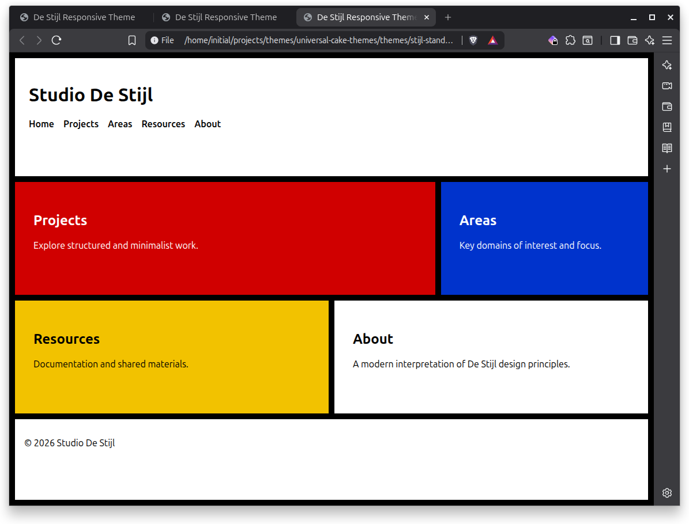
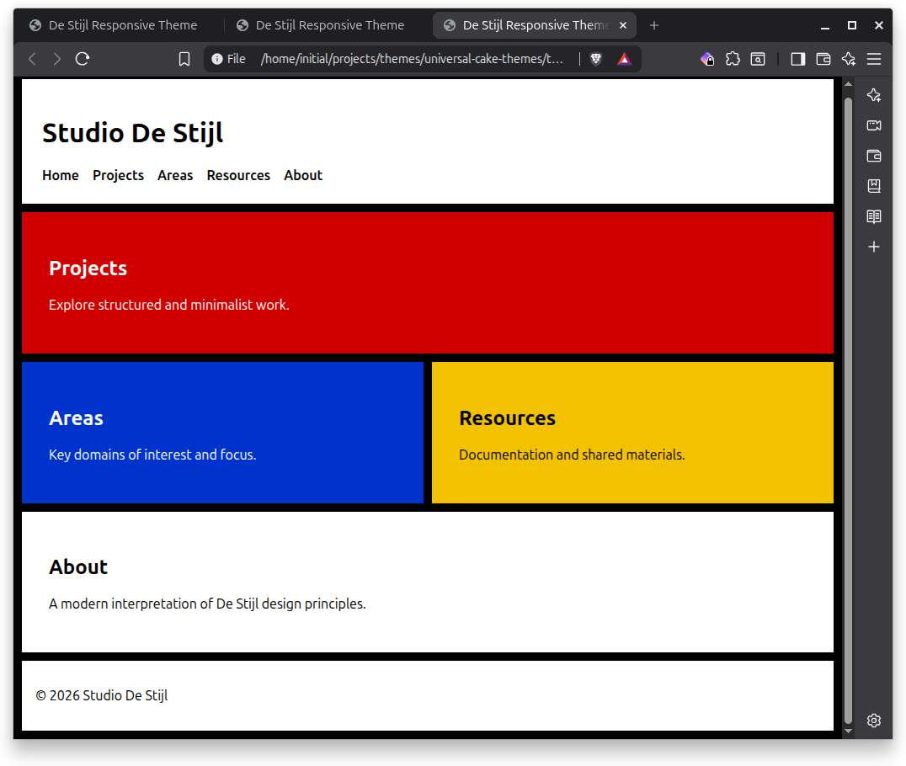
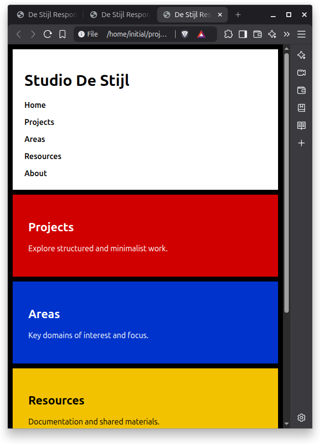

# Stijl Standard

Stijl Standard is a responsive De Stijl–inspired grid layout designed as a refined presentation layer within the Stijl theme family.

It builds on the structural concepts of `stijl-foundation` and introduces breakpoint refinement for desktop, tablet, and mobile environments.

This version is framework-agnostic and suitable for static HTML usage or adaptation into a MkDocs Material override layer.

------

## Images

### Desktop



### Tablet



### Mobile



## Design Inspiration

Stijl Standard draws from the Dutch De Stijl movement, associated with artists such as **Piet Mondrian** and **Theo van Doesburg**.

Core visual principles include:

- Primary color blocks
- Strong structural contrast
- Asymmetrical grid balance
- Clear typographic hierarchy
- Minimal decorative elements

------

## Purpose

Stijl Standard exists to:

- Provide a refined responsive layout
- Support workstation, tablet, and mobile breakpoints
- Serve as a visual identity layer
- Remain independent of specific static site generators
- Act as a candidate design layer for MkDocs Material

It does not:

- Claim WCAG AA or AAA compliance
- Include skip links or enhanced focus styling
- Replace generator navigation engines
- Include JavaScript dependencies

------

## Features

- CSS Grid–based layout
- 6-column desktop layout
- 4-column tablet refinement
- Single-column mobile collapse
- Primary color block system
- System font stack
- Zero external dependencies
- No JavaScript required

------

## Layout Structure

```
.wrapper
├── header
│   └── nav
├── main
│   ├── .projects
│   ├── .areas
│   ├── .resources
│   └── .about
└── footer
```

------

## Responsive Behavior

### Desktop (Default)

- 6-column grid
- Asymmetrical section spans
- Structured block layout

### Tablet (≤ 1024px)

- 4-column grid
- Projects and About expand full width
- Areas and Resources span two columns

### Mobile (≤ 600px)

- Single-column layout
- Vertical stacking of all sections
- Navigation switches to column orientation

------

## Color System

Defined via CSS custom properties:

```
--black:  #000
--white:  #ffffff
--red:    #d00000
--blue:   #0033cc
--yellow: #f2c200
--line:   10px
```

These variables define structural framing and visual identity.
 Accessibility-tuned variants may override these values.

------

## Architectural Role in the Stijl Family

```
stijl-foundation  → structural base
stijl-standard    → refined responsive layout
stijl-aa          → WCAG AA variant
stijl-aaa         → WCAG AAA variant
```

Stijl Standard introduces breakpoint refinement while preserving architectural clarity.

------

## Intended Use Cases

- Studio landing pages
- Documentation front pages
- Portfolio sites
- Static site prototypes
- Visual identity layer for MkDocs Material

------

## Integration Strategy for MkDocs Material

When used with MkDocs Material:

- Keep Material as the layout engine
- Apply Stijl Standard as a design override layer
- Override colors and section styling via CSS
- Avoid modifying core Material templates

This ensures upgrade safety and long-term maintainability.